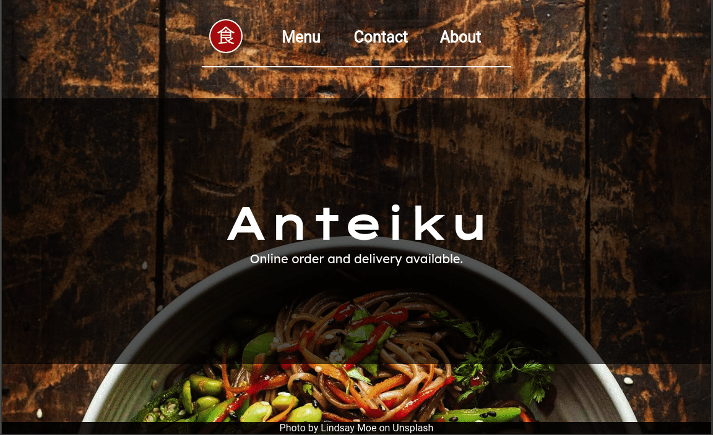

# Anteiku Restaurant

> This project is a restaurant page built with webpack and javascript ES6 modules

## Built With

- Javascript
- HTML
- CSS
- ESLint
- Stylelint
- Webpack
- yarn

## Live version

You can check the live version in [this link](https://gscarv13-restaurant-js.netlify.app/)

## Getting Started

To run this project locally, make sure you have the following installed:

- Node.js more information [here](https://nodejs.org/en/)
- Yarn package manager, more information [here](https://yarnpkg.com/)

### Setup and Install

- Clone this repository using the link above (click on the 'code' button)
- Open a terminal and `cd` to the cloned repository
- Run `yarn` to set up all dependencies

### Usage

- `cd` into `dist/` and open `index.html`
- Open the `index.html` file with your browser

## Authors

👤 **Gustavo Carvalho**

- GitHub: [@gscarv13](https://github.com/gscarv13)
- Twitter: [@Gscarv13](https://twitter.com/Gscarv13)
- LinkedIn: [Gustavo Carvalho](www.linkedin.com/in/gscarv13)

## 🤝 Contributing

Contributions, issues, and feature requests are welcome!

Feel free to check the [issues page](https://github.com/gscarv13/restaurant-js/issues).

## Show your support

Give a ⭐️ if you like this project!

## 📝 License

This project is [MIT](LICENSE) licensed.
